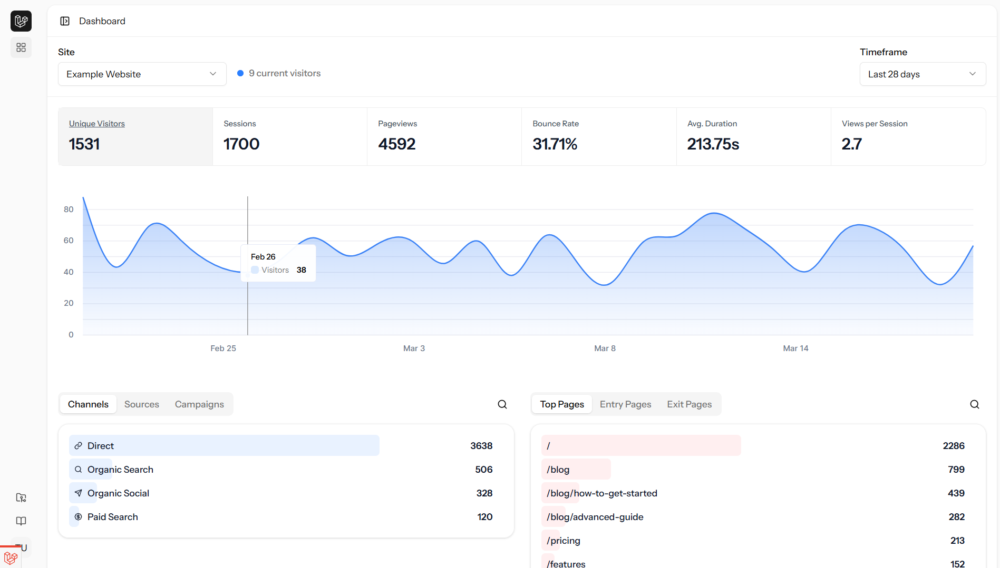

# Laravel Analytics

A privacy-focused analytics platform built with **Laravel**, **Inertia**, and **Vue**. Track page views, sessions, and visitor behavior with a lightweight script that collects essential analytics data for your websites.




## Features

- **Session-based Tracking**: Server-side session management with automatic session detection
- **Page View Analytics**: Optional page-level tracking for granular analysis
- **Geographic Data**: Built-in GeoIP support to track visitor locations
- **Device Detection**: Identifies browser, OS, and device type (mobile, tablet, desktop)
- **UTM Parameter Support**: Track marketing campaigns with automatic UTM parsing
- **Channel Classification**: Automatically categorize traffic sources
- **Interactive Dashboard**: Beautiful Vue.js-based dashboard with real-time data visualization
- **Country Map**: GeoJSON-powered interactive world map with visitor distribution

## Technology Stack

- **Backend**: [Laravel 11](https://laravel.com) - PHP web framework
- **Frontend**: [Inertia.js](https://inertiajs.com) + [Vue.js 3](https://vuejs.org) - Reactive UI framework
- **Client Tracking**: Minimal JavaScript client script (~1KB) for external sites
- **Geolocation**: Config-driven IP geolocation (local GeoIP2 DB or API provider)
- **Database**: SQLite/MySQL/PostgreSQL supported


## Getting Started

### Server Setup
This webapp can be deployed on any shared hosting which can run php. See the [deployment section](#deployment) for more details.

#### Requirements

- PHP 8.3 or higher
- Composer (optional)
- Node.js & npm/pnpm (optional)
- SQL database (optional)


### Client Script Integration

To track analytics on your website, add a single script tag before the closing `</body>` tag:

```html
<script src="https://{your-analytics-domain.com}/client.js?site_id={SITE_ID}"></script>
```

If you want to forward tracking through a same-origin path on the tracked site, add a hash path:

```html
<script src="https://{your-analytics-domain.com}/client.js?site_id={SITE_ID}#/analytics-forward"></script>
```

If your forward endpoint requires CSRF validation, pass a token with `csrf`:

```html
<script src="https://{your-analytics-domain.com}/client.js?site_id={SITE_ID}&csrf={CSRF_TOKEN}#/analytics-forward"></script>
```

The client always assumes the first `/` for the hash target, so `#analytics-forward` and `#/analytics-forward` resolve to the same forward path. Make sure you implement the forward handler on the tracked site's server; see [Third-Party Blocking and Forwarding](#third-party-blocking-and-forwarding).

Replace:
- `{your-analytics-domain.com}` with your analytics server URL
- `123` with your actual site ID from the analytics dashboard

That's it! The tracking script will automatically:
- Track page views
- Track SPA route changes automatically (History API, back/forward, and hash navigation)
- Detect sessions based on visitor fingerprinting
- Capture browser and device information
- Parse UTM parameters for campaign tracking
- Send data to your analytics server

The script only sends a page view after the visitor has stayed on the site for at least the minimum visit duration configured in the client *(default: 2s)*.

#### Optional Parameters

The script automatically captures:
- **Page pathname** - current page URL
- **Referrer** - previous page (if available)
- **Screen width** - device width (for device type detection)
- **UTM parameters** - utm_source, utm_medium, utm_campaign, utm_content, utm_term

You can also provide:
- **csrf** - optional token from the script URL query; sent as `_token` in the POST body for same-origin forward handlers that enforce CSRF. This is only necessary when forwarding is active and your site has csrf protection enabled for post requests.

No additional page view events need to be manually triggered.

For SPAs, manual tracking is usually not required because route changes are auto-detected. If you need explicit control, you can still trigger tracking with either global API:
- `window.trackAnalyticsPageview()`
- `window.analyticsClient?.trackPageview()`

### Third-Party Blocking and Forwarding

Some privacy tools block third-party beacon traffic. In practice this means requests from `site-a.com` to `analytics-b.com` can be dropped even when your endpoint is valid.

To improve deliverability, use a same-origin forward endpoint on the tracked site and pass it as a hash path in the script URL (for example `#/analytics-forward`). This can also improve precision for attribution in some deployments because the browser sees a first-party request path.

Example PHP forward handler:

```php
<?php

function forwardAnalyticsRequest(): void
{
   if (($_SERVER['REQUEST_METHOD'] ?? 'GET') !== 'POST') {
      http_response_code(405);
      return;
   }

   $target = isset($_POST['target_endpoint']) ? (string) $_POST['target_endpoint'] : '';
   if ($target === '') {
      http_response_code(400);
      return;
   }

   $ch = curl_init($target);
   curl_setopt_array($ch, [
      CURLOPT_POST => true,
      CURLOPT_POSTFIELDS => http_build_query($_POST),
      CURLOPT_RETURNTRANSFER => true,
      CURLOPT_CONNECTTIMEOUT => 2,
      CURLOPT_TIMEOUT => 3,
      CURLOPT_HTTPHEADER => [
         'Content-Type: application/x-www-form-urlencoded',
         'User-Agent: ' . ($_SERVER['HTTP_USER_AGENT'] ?? 'ForwardProxy/1.0'),
         'X-Forwarded-For: ' . ($_SERVER['HTTP_X_FORWARDED_FOR'] ?? ($_SERVER['REMOTE_ADDR'] ?? '')),
      ],
   ]);

   curl_exec($ch);
   $httpCode = (int) curl_getinfo($ch, CURLINFO_RESPONSE_CODE);
   curl_close($ch);

   http_response_code($httpCode >= 200 && $httpCode < 500 ? 204 : 202);
}

forwardAnalyticsRequest();
```

This forwarder intentionally does not re-validate analytics fields; validation remains centralized on the receiving analytics server.

Important notes:
- The forward endpoint should live on the same origin as the tracked site.
- Keep this endpoint lightweight and non-blocking.
- Do not treat forwarding as guaranteed delivery; users can still block analytics intentionally.

### Page View Tracking

This application tracks visits at two levels:

**Sessions**: Every visitor creates a session that captures:
- Entry and exit pages
- Page count within the session
- Session duration
- Traffic source and channel

**Individual Page Views** *(Optional)*:
When enabled in configuration, each page view is individually recorded. This provides more granular filtering and detailed page-level analysis but requires more database storage and has higher performance requirements.

Page view tracking is enabled by default to allow tracking of top pages on a given day and filtering sessions by pages. However, for most use cases, session-based analytics can provide sufficient insight with optimal performance.


### Geolocation Configuration

Geolocation is disabled by default and controlled through `config/analytics.php`:

- `geoip.enabled`: Enables/disables all IP geolocation lookups.
- `geoip.has_local_db`: When `true`, the app tries the local GeoIP2 database first.
- `geoip.endpoint`: API endpoint used when local DB is disabled/unavailable.
- `geoip.rate_limit`: Rate limit used for provider API lookups.

Default provider endpoint: [ip-api.com](https://ip-api.com/)
> Before enabling API-based geolocation, review and comply with your provider's terms and usage limits ([ip-api.com terms](https://ip-api.com/)).

If you want local database lookups:

1. Create a MaxMind account and download `GeoLite2-City.mmdb`
2. Place the file in `storage/app/GeoLite2-City.mmdb`
3. Install the GeoIP2 PHP library:
   ```bash
   composer require geoip2/geoip2
   ```


## Legal Disclaimer

**Important**: This project implements analytics collection similar to privacy-focused services like [Plausible.io](https://plausible.io). However, depending on your jurisdiction and the regions your websites serve, **you may be legally required to obtain user consent before tracking**.

**Legal Responsibility**: The authors and contributors of this project cannot be held liable for any legal issues arising from your use of this software. **It is your responsibility to**:
- Review your local and international privacy laws (GDPR, CCPA, PECR, ePrivacy Directive, etc.)
- Obtain proper user consent where required
- Display clear privacy policies explaining data collection
- Provide users with the ability to opt-out
- Ensure compliance with applicable data protection regulations

Always consult with a legal professional regarding your specific compliance obligations.

## Deployment

For production deployment instructions, consult the [Laravel Deployment Documentation](https://laravel.com/docs/13.x/deployment).

### FTP Deployment

This project includes an FTP deploy command for shared-hosting workflows:

```bash
php artisan deploy:ftp
```

Flags:
- `--dry-run` to preview what will be uploaded
- `--framework` to ensure required framework directories and `.gitignore` files exist before deploy *(run this only on your first deployment command)*
- `--vendor` to explicitly include the `vendor` directory

Configure FTP credentials and include/exclude paths in `config/ftp.php` and your environment variables.

### Building for Deployment

If your hosting provider doesn't support Composer or Node.js, you can build the application locally and upload the compiled files:

1. Complete all installation and build steps locally (steps 1-7 in Development section)
2. Run `pnpm run build` to generate production assets
3. Upload the entire project to your hosting provider *(excluding node_modules)*
4. Run `php artisan migrate` on the server to set up the database
5. Set appropriate permissions for `storage/` and `bootstrap/cache/` directories

The pre-built assets will be available in the `public/build/` directory and ready to serve.

## Development
#### Installation

1. **Clone the repository**
   ```bash
   git clone <repository-url>
   cd analytics
   ```

2. **Install PHP dependencies**
   ```bash
   composer install
   ```

3. **Install JavaScript dependencies**
   ```bash
   pnpm install
   ```

4. **Setup environment**
   ```bash
   cp .env.example .env
   php artisan key:generate
   ```

5. **Configure your database** in `.env`:
   ```
   DB_CONNECTION=mysql
   DB_HOST=127.0.0.1
   DB_PORT=3306
   DB_DATABASE=analytics
   DB_USERNAME=root
   DB_PASSWORD=
   ```

6. **Run migrations**
   ```bash
   php artisan migrate
   ```

7. **Build assets**
   ```bash
   pnpm run build
   ```

8. **Start the development server**
   ```bash
   php artisan serve
   ```
   The application will be available at `http://localhost:8000`

 For local development, use the included development commands:

```bash
pnpm dev
```

This starts Vite in watch mode for hot module reloading during development.

## Implementation Details

### Dashboard GeoJSON Country Map Caching

The country map displays visitor data overlaid on a world map using Leaflet.js and GeoJSON features. To optimize performance and reduce bandwidth, the application implements a two-tier caching strategy:
- **[Server-side filtering](app/Http/Controllers/DashboardController.php)** ensures only requested country features from the GeoJSON file are sent
- **[Client-side incremental caching](resources/js/components/CountryMap.vue)** stores fetched features in IndexedDB and only requests missing countries

## Example Privacy Policy Text (Analytics)

The following section is a sample you can adapt for your own privacy policy when using this analytics application.

> **Not legal advice**: This example is provided for informational purposes only and does not constitute legal advice. You are responsible for obtaining legal advice appropriate to your jurisdiction, industry, and data processing practices.

### Suggested Privacy Policy Wording

We use a self-hosted analytics tool to understand how visitors use our website and to improve our content and services.

**What data we collect**

When you visit our website, we may collect:

- **Page and visit metadata**: page path (URL path), hostname, date/time of page view, and whether it was the first page in a visit
- **Session analytics**: session start time, session duration, number of pages viewed in a session, entry page, and exit page
- **Traffic source information**: referrer URL, referrer domain, campaign parameters (`utm_source`, `utm_medium`, `utm_campaign`, `utm_content`, `utm_term`), and derived marketing channel classification
- **Device and technical information**: browser name/version, operating system/version, screen width, and derived device type (mobile/tablet/desktop)
- **Approximate location data** (if enabled): country code, subdivision/region code, and city derived from IP geolocation
- **Network data used for request handling**: IP address and user-agent string are processed in-memory to generate a pseudonymous visitor identifier for session detection and anti-abuse protections

**Pseudonymous identifiers**

We use one-way hashing and a daily rotating salt for pseudonymous visitor identifiers. This limits visitor linking to short windows and helps prevent long-term cross-day correlation.

**What we do not collect through this analytics tool**

- We do not use this analytics tool to intentionally collect directly identifying information such as your name, email address, or phone number.
- We do not use this analytics tool to intentionally collect special category (sensitive) personal data.
- We do not persist raw IP addresses or raw user-agent strings as standalone analytics identifiers.

**How we use this data**

We process analytics data to:

- measure website performance and usage trends
- understand which pages and campaigns are effective
- detect technical issues and improve user experience
- prevent abuse and maintain security of our services

**Legal basis (EEA/UK): legitimate interests**

Where applicable, we rely on **legitimate interests** as the legal basis for analytics processing, specifically our interest in operating, securing, and improving our website and services. We assess this interest against user rights and apply data minimization and retention controls.

If local law requires consent for analytics technologies, we request consent before collecting analytics data and honor user choices.

**Retention**

We retain analytics data only for as long as needed for reporting, security, and operational purposes, then delete or anonymize it according to our retention schedule.

Due to daily salt rotation, visitor linking is limited to a 24-hour window. After rotation, prior pseudonymous identifiers cannot be regenerated with the new salt and are effectively anonymized for future correlation.

**Sharing**

We do not sell analytics data. We may share analytics data with trusted service providers only as needed to host and operate our systems, subject to contractual confidentiality and data protection obligations.

**Your rights**

Depending on your location, you may have rights to access, correct, delete, restrict, or object to processing of personal data, and to lodge a complaint with a supervisory authority. To exercise rights, contact us using the details in this policy.

**International transfers**

If analytics data is transferred internationally, we implement appropriate safeguards required by applicable law.

**Contact**

If you have questions about this analytics processing, contact us at: `[your privacy contact email]`.

---

### Implementation Notes For Site Owners

Before publishing your privacy policy, verify the text above against your actual configuration:

- whether geolocation is enabled or disabled
- whether pageview-level tracking is enabled
- whether your deployment uses forwarding endpoints or third-party providers
- your actual retention period and deletion process
- whether consent is required in your jurisdiction

## Implementation Details

### Dashboard GeoJSON Country Map Caching

The country map displays visitor data overlaid on a world map using Leaflet.js and GeoJSON features. To optimize performance and reduce bandwidth, the application implements a two-tier caching strategy:
- **[Server-side filtering](app/Http/Controllers/DashboardController.php)** ensures only requested country features from the GeoJSON file are sent
- **[Client-side incremental caching](resources/js/components/CountryMap.vue)** stores fetched features in IndexedDB and only requests missing countries